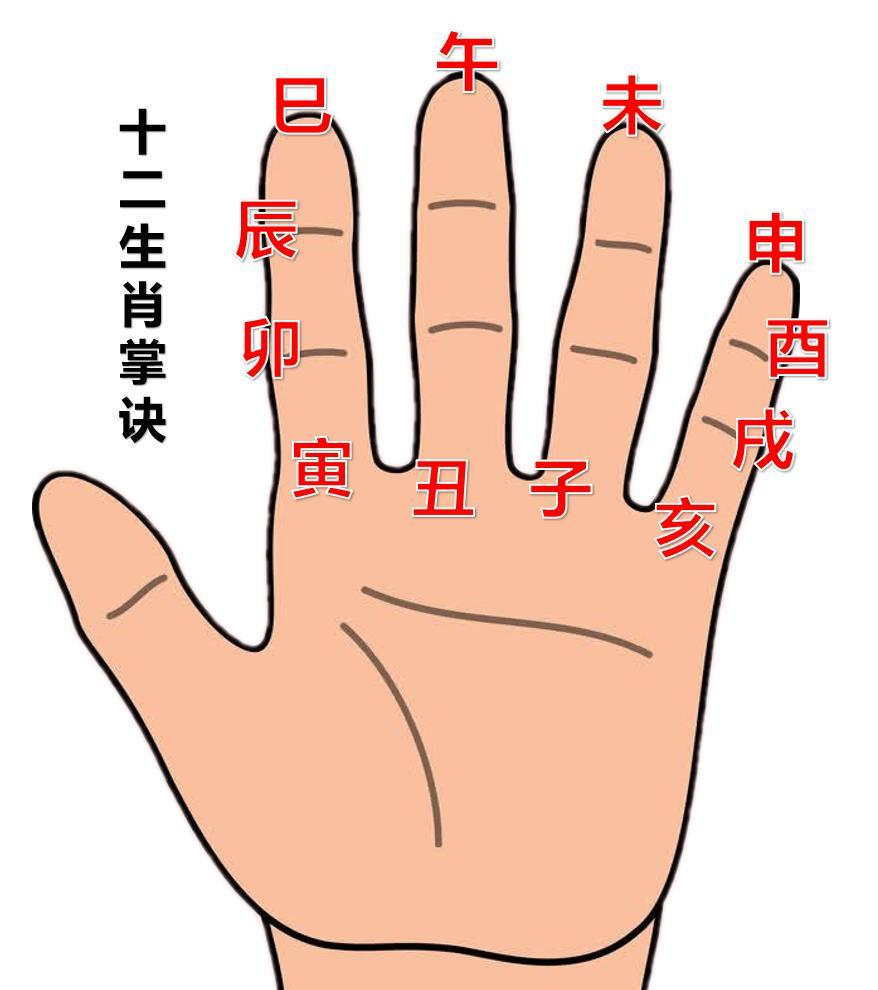

### 天干地支

甲丙戊庚壬为阳 乙丁己辛癸为阴

子寅辰午申戊为阳 丑卯巳未酉亥为阴

十天干掌决图

十二地支掌决图

### 四柱

四柱即为年日月时 年柱—1-15月柱—16-30 日柱—31-45 时柱—46-晚年

四柱全阳、全阴表现在男女各有不同 男本阳、女本阴

### 五行

木火土金水 顺位相生，隔位相克

### 天干地支与五行

东方甲乙寅卯木，南方丙丁巳午火，西方庚辛申酉金，北方壬癸亥子水，中央戊己辰戌丑未土

### 六十甲子 （也应背）

六十为一轮回 年、月、日

一旬为十年，甲子旬、甲申旬…… 在本旬未出现的地支叫做空亡

根据什么旬即可找出空亡 利用地支掌决图如今天为庚午日 则找到午-中指位置然后以此为庚逆时针数到甲即甲子，则为甲子旬空亡为戌亥。

### 冲合

#### 地支冲合

子丑合化土，寅亥合化木，卯戌合化火，辰酉合化金，巳申合化水，午未合化土（有时合化火）在掌决中以中轴线左右对称相合

