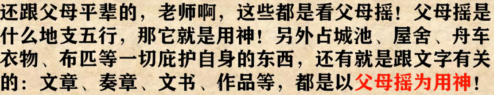
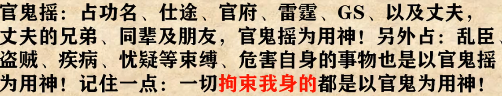
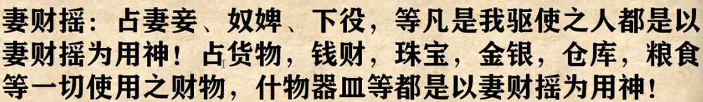
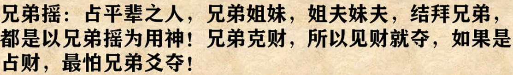
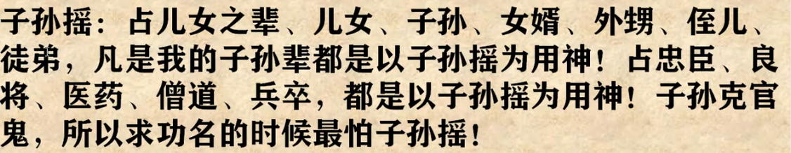
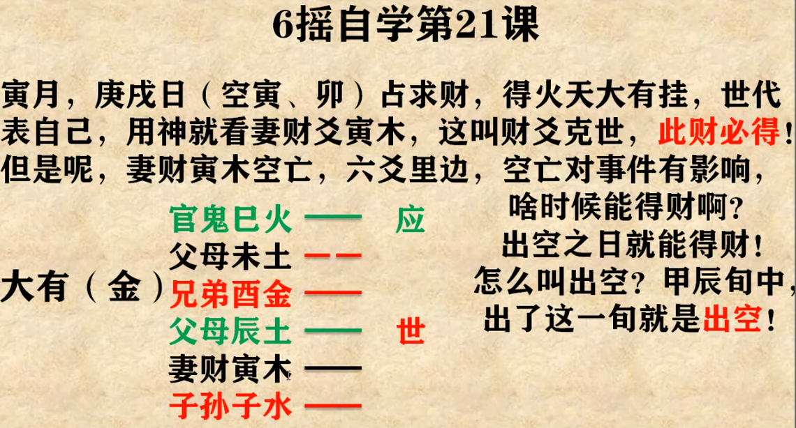
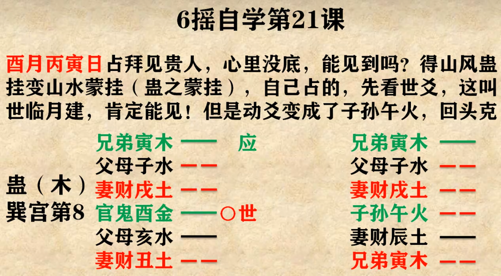
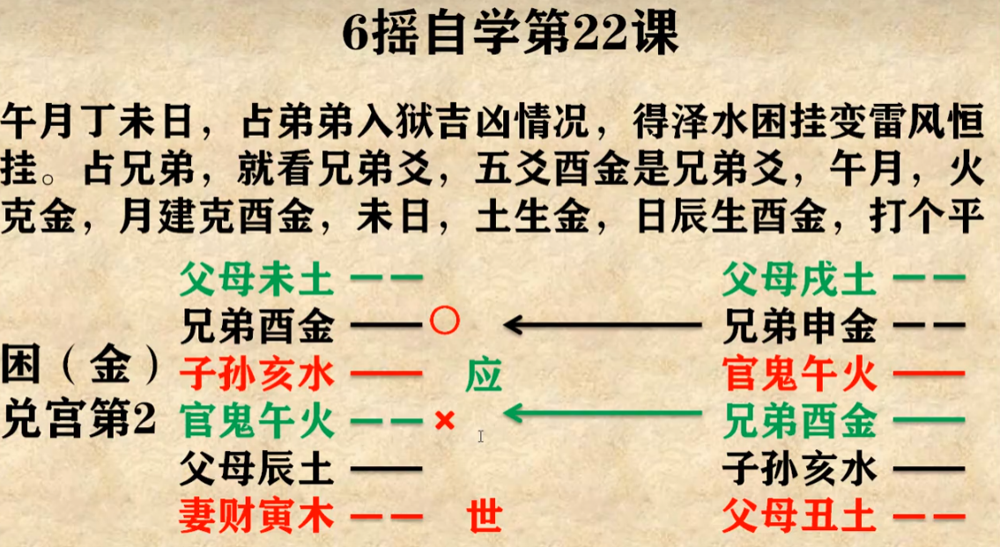
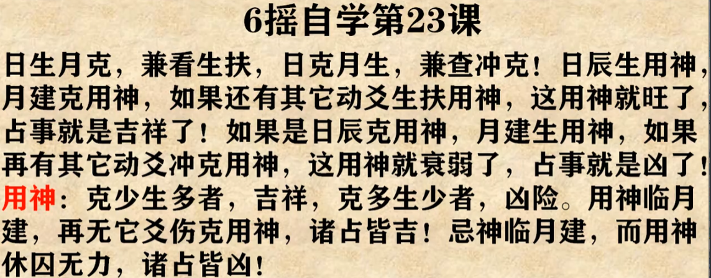

凡是 ‘#’所修饰的词都是当下学时涉及但未讲的词

### 六十四卦

### 八卦与五行

 乾兑属金，离属火，震巽属木，坎属水，艮坤属土。乾宫八卦五行都属金……                        

#### 反变法  寻母宫卦

从初爻开始依次变卦，直到变成与上挂一样的，直到变到上卦时改为变四爻，再没有再变下三卦。

### 安世应
天人归一天同二；天地在三错在三。地同人同世在四；地人相同世在五。世爻为一卦之主，应爻则与之相应。此法无需寻母宫

安世歌：八卦之首世当上，以下初爻轮上飑，游魂七位四爻立，归魂八位三爻详。此法需要寻母宫

确定世爻后，应爻与之相差两爻，间爻为二者中间二爻

### 八卦的阴阳

除了乾坤为一阳一阴之外，剩余的什么爻少就是什么，阴爻少就是阴，例如巽、离。

### 地支的阴阳

子为阳，其后为阴、阳、阴、阳……

### 六十四卦装地支

上下挂是分开的，其中阳卦装阳支，阴卦装阴支。上下卦相同时分别是相冲的-六冲卦。

乾、震、坎、艮四阳卦在下挂时初爻为子、子、寅、辰，依次顺排，子寅辰午申戌。例如乾卦 依次为子寅辰午申戌

巽、离、兑、坤四阴卦在下卦时初爻为丑、卯、巳、未，依次逆排，丑亥酉未巳卯。例如巽卦 为丑亥酉未巳卯

### 六亲

以母宫卦为“我”  同我者-兄弟 我生者-子孙 我克者-妻财 克我者-官鬼 生我者-父母

对比本宫和每一爻的五行之间生克关系 写出六亲

#### 六亲相生-顺次相生

兄弟生子孙，子孙生妻财，妻财生官鬼，官鬼生父母，父母生兄弟

#### 六亲相克-隔位相克

兄弟克妻财，妻财克父母，父母克子孙，子孙克官鬼，官鬼克兄弟

### 摇卦

字为阳 面为阴 摇六次   之卦(变)看五行时用本卦的五行写出六亲即可

#重、交？**13课有个经典案例**学会解卦之后再看

#### 断卦

先定用神，原神 再看月建日辰对用神的冲、克，再看动爻 是否有动化回头生、回头克，贪合忘生、忘克，进神退神……

#### 自占

如果摇出**六冲卦**，刚得的急病，会有好转；若是经年老病，可能会出问题。正所谓近病不药而愈，久病妙药难调  六冲卦也寓意着事物不长久

如果求财 自己占的时候不管动不动、变不变 就看世 在财爻也就是妻财，就可做，叫做妻财持世！  若在兄弟爻，就不可干，兄弟持世！

看官升迁 同样不管动不动，变爻 如果世在官鬼爻 就没事 子孙持世就不可，要等等

防忧虑患 官司缠身，盗窃，妨害，不管动变，世在子孙爻，就没问题 若官鬼持世则忧患难解，多加小心  
如果所求摇出不是上述情况 急事再摇，不急过几天再说

#### 精细占

父母爻

官鬼爻

妻财爻

兄弟爻

子孙爻

**名词**

**用神**-所占的壬的事的代表 ：**原神**-生、助用神的爻(视频所讲用的五行相生)；**忌神**-克用神的爻(视频所讲用五行相克)：**仇神**-生忌神的爻(同样用的五行相生)

**月建**-又叫月将！占卦的月如酉月 **日辰**-占卦这天如庚午 **主要看地支五行**，**二者是看用神旺衰**(八字中旺相休囚)

**案例**

世爻指的是自己，应爻指的是他人。**动爻就有生克**。应爻生世爻为恩人，应爻克世爻为仇人。间爻独发，不作用世应或者克世应者为阻碍，有制者为吉。

变爻要跟变之前的母宫卦五行相论，只能对变之前的爻产生作用 

如果有多个用神，则利用月辰找旺相，用旺相

忌神原神一起动，忌神就不克原神，而是生原神，原神生用神

变爻如果跟变之后的相合，就有贪合忘生、贪合忘克

财爻克世此财必得

出现空亡 1.用神逢空 当下得不到，出空之日可得到 2.忌神逢空 出空有祸

如果卦中**用神**爻值月建，就是旺 ，如果这个值月建的爻被卦中其他的爻克伤，叫逢伤，占病当下不会痊愈，占事眼下也不会成。直到某一天地支可以冲掉伤克用神的爻就成了。

此例三爻变后被克叫**动化回头克** 直到下一个子日才得以见贵人

#22涉及**三合局**

月建克，日辰生暂时打成平手   

月建入卦更显刚强；月建入卦，动、而做原神者为福更大，动而做忌神者为祸更深！

凶在何时？  占卦为辰年，申年被施以重刑

日生月克，兼看生扶，日克月生，兼看冲克！ 

#用神入墓 

#### 月建

#### 日辰日建  “天干无用”

日辰干支都写有三大作用：1.找六神 2.找空亡 3.定神煞   

月建冲爻，叫**月破** 日辰冲爻叫**暗动**(冲旺相的静爻)**日破**(冲衰弱的静爻)  空亡又叫旬空日辰冲他，**冲空则实**  动爻变爻相合遇到日辰冲，可以冲开

出现多个用神，用当令的

#### 变卦 神兆机于动，动必有因，事无吉凶则不动已有

此说的并非动爻，而是变前后的卦

变生  化生 也就是变后的**卦**动化回头生 

变克  化克 也就是变后的**卦**动化回头克  这种为凶

#### 飞神、伏神

如果占财，卦中没有妻财爻，这叫用神不上卦。如果是卦属金，妻财爻就是寅卯木，如果在寅卯月或者日占的可以用月建日建作用神；如果没有就用此卦的母宫卦中妻财爻作用神。借用的这个用神叫做**伏神**，将其放到占出卦相同位置的下面,如果是母宫卦二爻是妻财爻则将这个妻财寅木放到占出的二爻下面一爻上面，占出卦的二爻叫做**飞神**。

飞来生伏，吉 飞来克伏，凶

#### 六神  青龙 朱雀 勾陈 腾蛇 白虎 玄武

依据日辰天干 东方甲乙青龙 南方丙丁朱雀 西方庚辛白虎 北方壬癸玄武 中央戊勾陈 己腾蛇 

用法：哪日占事将对应的六神放置于初爻，依次装完

白虎遇属金的爻叫白虎衔刀 凶上加凶   

#### 进神 退神

同一地支五行的进、退。如寅卯木，寅木变卯木

**进神**代表事物进一步的发展，如果是用神或原神，代表有好的进展，忌神或仇神就代表对用神不利 **退神相反**
