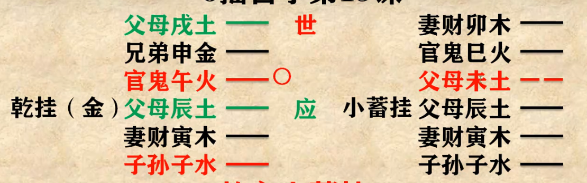
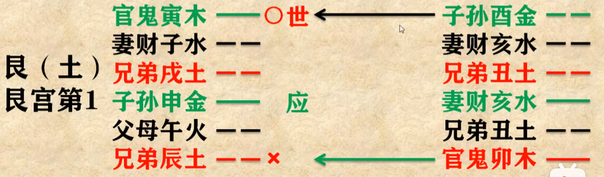

黄离论易自学六爻

案例一-19课

丑日病好

案例二-23课

艮之明夷卦 **六冲卦**。世爻（为自己）临月建，吉，但不长久(六冲)，再看 日辰克用神，打个平手。（月生日克兼查冲克）用神 动化回头克，不吉。当下开张，开始买卖或许不错，但生少克多并不长久。再看世爻是官鬼，往往官司、疾病，官鬼在身边需防疾病，应爻代表合伙人申金，寅申冲，必遭其拖累。六月闹病八月伙计卷钱跑路，六月未土，土旺金相，寅木在未月休囚无力。为啥应期为未月，未是寅木的墓。八月酉金应爻当令冲克有力， 妻财子水落空亡，所以财被盗尽。

吉凶看世爻五行生克，具体结合六亲冲合判断