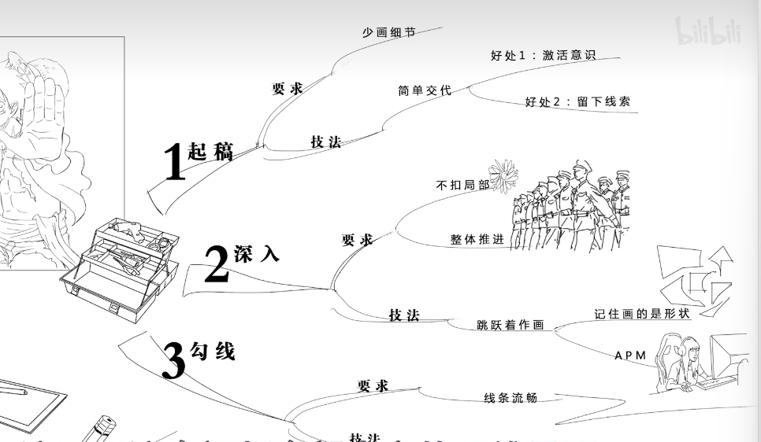

### 要有形状意识

## 形状意识

技巧一   起稿

用松动的笔法简单交代  可以在起稿的时候用，用不太准的型来提醒我时刻注意型准的同时还可以用来交代画出来大概是什么样子，哪怕是错误的形状也可以提供一些参考，直接在其上修改即可

技巧二   起稿 深入

跳跃着作画  不要去扣局部，这里画完一点再去别处画一点，相当于整体齐头并进，同时画的时候要注意不要太注意你所画的是什么，都是形状，要做到先画大形再画小形；也要做到手是在一直画、一直修改的状态，即使看起来没什么大问题也要不停的微调，这样可以保证你的手速在线，一直在思考而不是一顿一顿。

在起稿时就要有跳开画的念头，这样可以避免不知道从哪开始下手，从而快速进入状态。 一定要将跳开画这个观点变成肌肉动作，深深的印入脑子

技巧三  勾线

先修改再比对， 