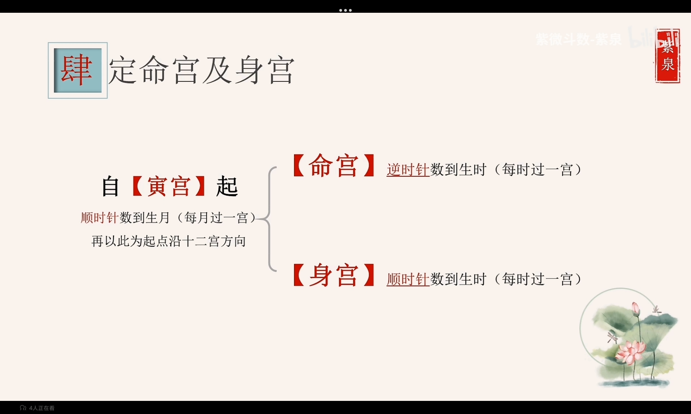
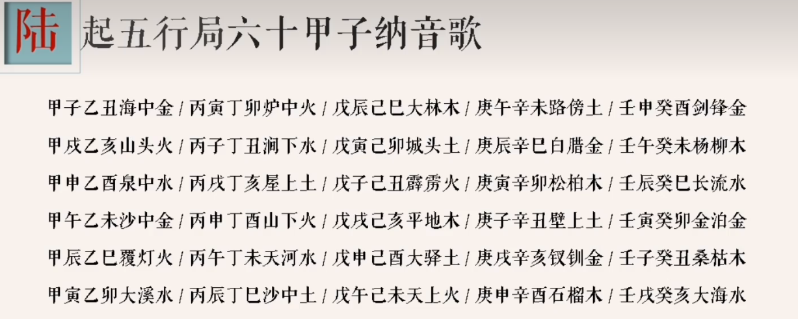
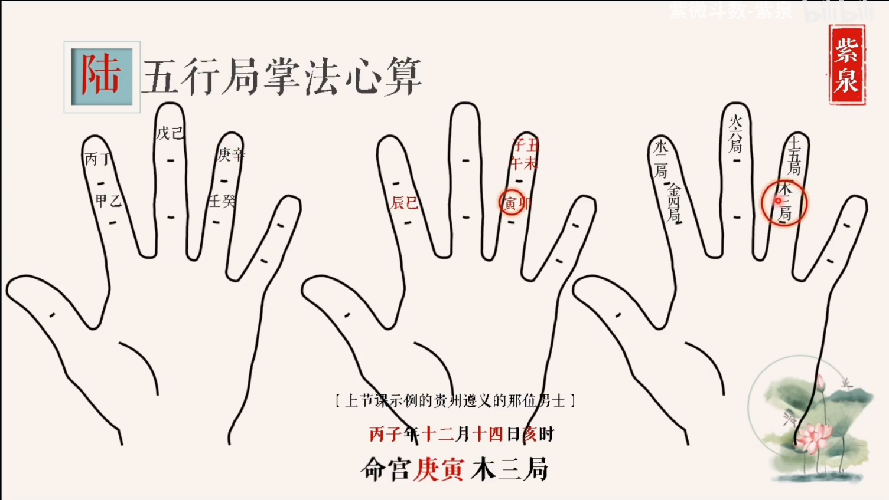
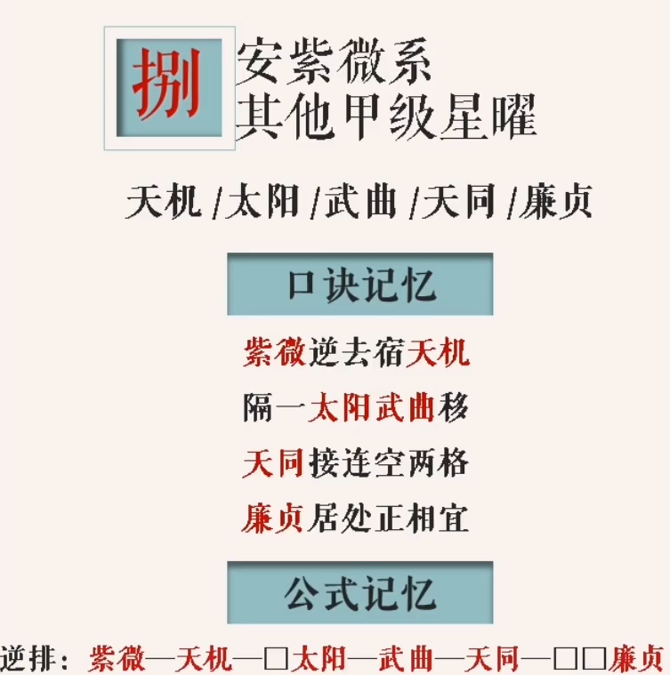

##### 一 定农历生辰

具体时间按照出生地的东经-120每减少1减少40分钟反之则增加

##### 二 画命盘并填十二地支

从命盘左下角第二个开始是子，顺时针依次排盘

##### 三 起寅首天干(定寅宫的天干并依次写出所有天干)

以命主出生年份天干为起点，顺时针写出从寅宫开始的天干。

甲己年为丙，乙庚年为戊，丙辛年为庚，丁壬年为壬，戊癸年为甲。

如：丙子年，则寅宫为庚，依次从寅宫顺时针排列庚、辛、壬、癸、甲、乙……

##### 四 定命身宫

##### 五 定十二人事宫

从命宫开始逆时针排列依次是命宫、兄弟宫、夫妻宫、子女宫、财帛宫、疾厄宫、迁移宫、仆役宫（交友宫）、官禄宫、田宅宫、福德宫、父母宫十二个宫位。

##### 六 起五行局

注：水二局、木三局、、金四局、土五局、、火六局

​         由**命宫**位所在的天干地支所决定

起局方法：1.六十甲子纳音歌

​					2.掌法心算

此人为庚，则从此处两两一组顺时针取地支三组一循环，找到后再看是哪一个五行局

##### 七 定紫薇星宫位

农历生日数字/五行局数 = 商数{1.整除的话商数即是紫微星所在位置2.若不能整除生日数需要加上一个虚借的最小整数(所借若为及奇数则商数减去该数为紫微星所在；若为偶数，则商数加上该数)} 从寅宫为一顺时针数起

##### 八 安紫薇系其他甲级星曜

##### 九 定天府星宫位

##### 十 安天府系其他甲级星曜

##### 十一 安六吉星

##### 12 安禄存和天马

##### 13 安六煞星

##### 14 定四化

##### 15 安其他丙级星曜

##### 16 起大限
