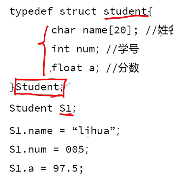
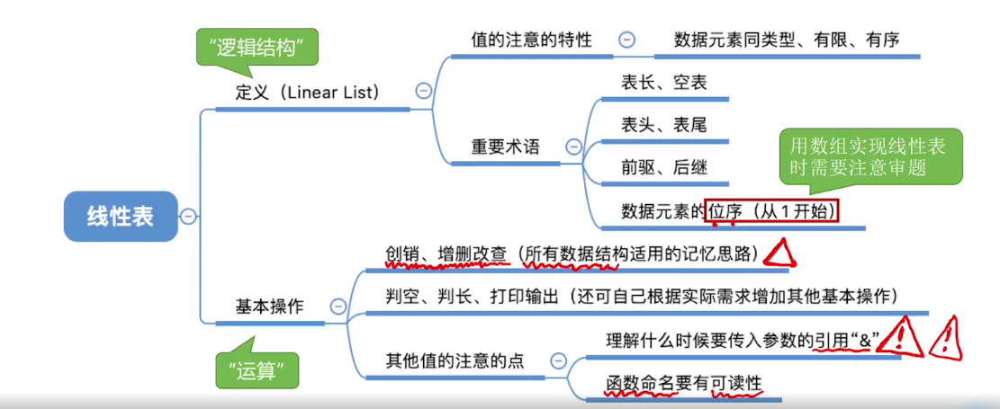

### c语言基础

1.结构体

2.typedef与define  前者是为基本数据类型定义新名 后者为变量赋值

3.数组

4.指针

## 数据结构

### 基本概念

1.数据 2.数据元素 数据的基本单位 3.数据项 数据元素不可分割的最小单位 4.数据对象 具有相同性质的数据元素的集合 5.数据结构

### 三要素

#### 逻辑结构:

1.线性结构-仅有一个开始和一个终端结点；非线性结构-一个结点可能有多个直接前趋和后继，如图和树。

2.集合、线性结构、图形结构、树形结构

#### 物理结构(存储结构)

顺序存储结构、链式存储结构、索引存储结构、散列存储结构

####  数据的运算增删改查

### 抽象数据类型定义 ADT

ADT = (D,R,0) D 数据对象 R逻辑关系 0 运算

### 题

举一个数据结构的例子，

## 算法效率的分析

### 算法定义 理解

### 算法与程序

### 算法特性

输入(不一定需要) 输出 有穷性 确定性 可行性

### 算法设计的要求

正确性 可读性 健壮性 高效性

### 算法时间效率的度量

1.事后统计 2.事前分析 

T(n) = O(f(n))  找出语句频度最大的作为基本语句，计算语句频度得到问题规模n 的某个函数f(n)取其数量级用o表示

加法法则：取最大 乘法法则：数量级相乘


$$
O(1)<O(log_2n)<O(n)<O(nlog_2n)<O(n^3)<O(n^3)<O(2^n)<O(n!)<O(n^n)
$$


### 算法空间效率的度量

## 线性表

### 基本操作

initlist（&a） 初始化分配内存空间

destroylist 销毁操作，销毁并释放内存

listinser 插入

删除操作，按值查找，按位查找

### 什么时候需要使用引用&

需要将函数修改的结果带回到main函数需要加&



## 单链表

优点：不要求大片存储空间

缺点：耗费一定空间用来用指针

```
struct 结点{
	数据域；
	指针域
}；
```

当函数调用单链表的时候 用Lnode* 命名的时候强调调用的是结点，用struct L当参数的时候，强调是从单链表中调用

创建链表时：带头节点V.S.不带头结点  前者用Lnote* 与macllo申请一片内存空间,当Lnote* 指向的next为空时链表为空；后者头指针为空，链表为空


## 时间复杂度专项

选择+大题

选择

大题 写一个程序，写出他的时间复杂度

基本规则：1.只有常数项，没有下面三种为O(1)

2.顺序结构 for+for、for按加法规则O(n)+O(n方) 选最大

3.循环嵌套 按乘法计算   核心在于循环了几次 

4.分支，ifelse switchcase 复杂度取最大值就是if 或者else里的最大值

可能会涉及等差数列，等比数列

等差数列求和--首项加末项×项数除以2